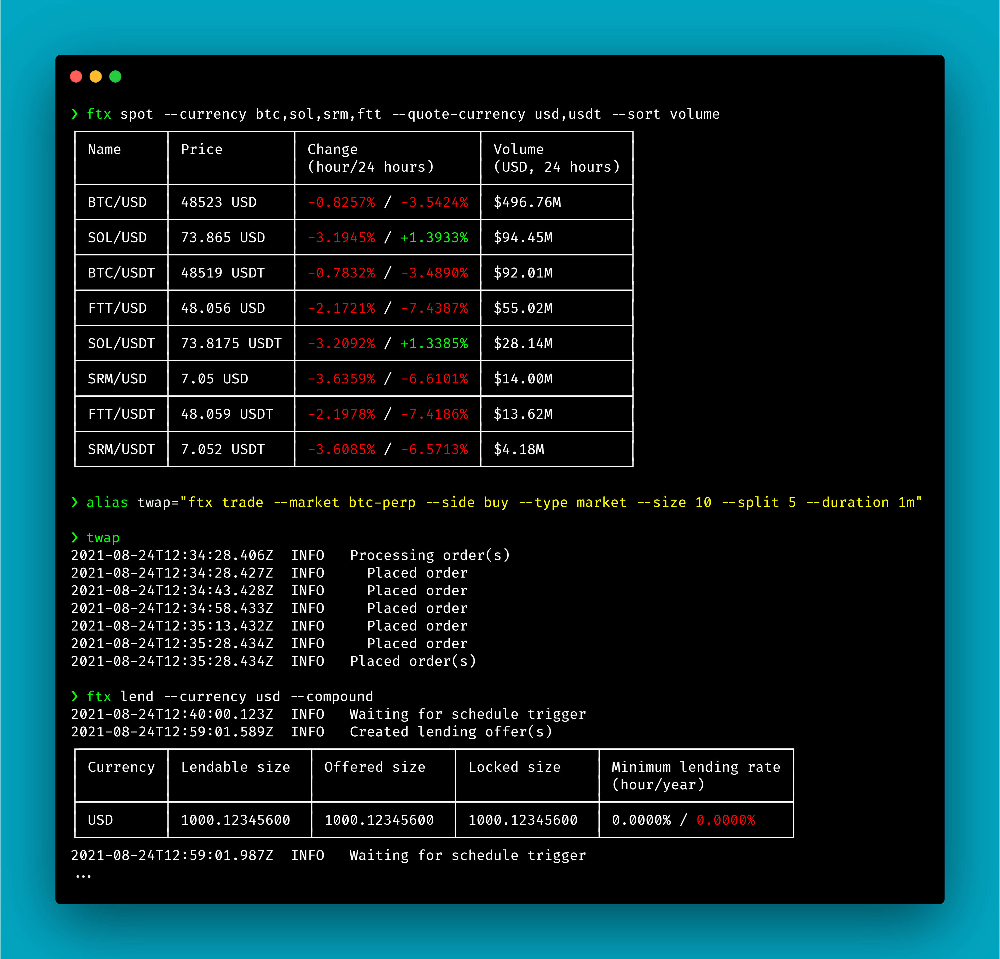

# [](https://github.com/dusktrades/ftx-cli)

> 💸 Supercharged FTX lending from the command line.

[](https://www.npmjs.com/package/ftx-cli) [](https://www.npmjs.com/package/ftx-cli) [](LICENSE) [](https://www.npmjs.com/package/ftx-cli) [](https://twitter.com/dusktrades)



## Contents

- [Features](#features)
- [Prerequisites](#prerequisites)
- [Installation](#installation)
  - [Try it out](#try-it-out)
  - [Global package (recommended)](#global-package-recommended)
  - [Build from source](#build-from-source)
- [Getting started](#getting-started)
  - [Obtain API credentials](#obtain-api-credentials)
  - [Secure API credentials](#secure-api-credentials)
  - [Resources](#resources)
- [Usage](#usage)
  - [Global options](#global-options)
  - [Login](#login)
  - [Logout](#logout)
  - [Config](#config)
  - [Rates](#rates)
  - [Earnings](#earnings)
  - [Offers](#offers)
  - [Lend](#lend)
  - [Stop](#stop)
  - [Spot](#spot)
  - [Futures](#futures)
- [Examples](#examples)
  - [Using subaccounts](#using-subaccounts)
  - [Repeating commands and auto-compounding](#repeating-commands-and-auto-compounding)
- [FAQ](#faq)
- [Disclaimer](#disclaimer)
- [Contact](#contact)
- [Donate](#donate)
- [License](#license)


## Features

🌍 **Global exchange:** supports FTX and FTX US\
👤 **Multiple logins:** allows switching between API credentials and subaccounts\
📊 **Better metrics:** displays all the metrics provided by FTX and more\
🔁 **Repeat commands:** compounds lending offers automatically via inbuilt command scheduler\
⏲️ **Custom schedules:** repeats commands hourly or using custom cron expressions\
🔐 **Self-hosted:** retains your control over your API credentials\
⚙️ **Close to the metal:** remains faithful to FTX terminology, options, and errors


## Prerequisites

- Node.js v14.13.0+

The quickest and easiest way to install or update Node.js is via [nvm](https://github.com/nvm-sh/nvm).


## Installation

### Try it out

Before you install, why not try one of the commands out? This one doesn't require authentication and will display information on lending rates.

```sh
npx ftx-cli rates
```

### Global package (recommended)

The quickest and easiest way to install is globally from [npm](https://www.npmjs.com/package/ftx-cli).

```sh
npm install --global ftx-cli
```

### Build from source

You can also download (or clone) and install the package manually.

```sh
git clone https://github.com/dusktrades/ftx-cli
cd ftx-cli
npm install --global
```


## Getting started

### Obtain API credentials

1. Create a new account (5% fees discount) on [FTX](https://ftx.com/#a=dusktrades) or [FTX US](https://ftx.us/#a=dusktrades)
2. [Settings](https://ftx.com/profile#a=dusktrades) > Margin > 'ENABLE SPOT MARGIN TRADING'
3. [Settings](https://ftx.com/profile#a=dusktrades) > Api > 'CREATE API KEY'
4. Note credentials down temporarily

### Secure API credentials

1. Edit API key permissions to the minimum required for this package to function properly
   - Disable 'Read-only'
   - Disable 'Withdrawals enabled'
   - Disable 'Internal transfers enabled'
2. If you know the static IP address(es) you will be using, you can further improve security by whitelisting them via 'WHITELIST IP'

### Resources

- [Margin Lending (UI)](https://ftx.com/spot-margin/lending#a=dusktrades) ([FTX US](https://ftx.us/spot-margin/lending#a=dusktrades))
- [Spot Margin Trading Explainer (Article)](https://help.ftx.com/hc/en-us/articles/360053007671-Spot-Margin-Trading-Explainer)
- [FTX Guide: How to Borrow and Lend on FTX (Video)](https://www.youtube.com/watch?v=0ms7u__Gbys)


## Usage

If you need a quick reminder or link back here in future, try `ftx --help`.

### Global options

You can inline these options with any command to modify its behaviour. Inline options take priority over stored credentials/config.

| Option                           | Description                                                                                            | Default       | Notes                                                                           |
| -------------------------------- | ------------------------------------------------------------------------------------------------------ | ------------- | ------------------------------------------------------------------------------- |
| `-e, --exchange <exchange>`      | FTX exchange platform ([FTX](https://ftx.com/#a=dusktrades) or [FTX US](https://ftx.us/#a=dusktrades)) | `ftx`         | Options: `ftx`, `ftx-us`                                                        |
| `-k, --key <key>`                | FTX API key                                                                                            |               |                                                                                 |
| `-x, --secret <secret>`          | FTX API secret                                                                                         |               |                                                                                 |
| `-a, --subaccount <subaccount>`  | FTX subaccount name                                                                                    | No subaccount | [Learn more about using subaccounts](#using-subaccounts)                        |
| `-z, --repeat [cron expression]` | Repeat the command with optional cron schedule                                                         | `false`       | [Learn more about repeating commands](#repeating-commands-and-auto-compounding) |
| `--colour`                       | Enable coloured output                                                                                 | `true`        | Disable: `--no-colour`                                                          |

### Login

Store FTX API credentials locally. This provides a convenient method of remaining authenticated with FTX. Please note any previously stored credentials will be overwritten.

| Option                          | Description         | Default       | Notes                                                    |
| ------------------------------- | ------------------- | ------------- | -------------------------------------------------------- |
| `-k, --key <key>`               | FTX API key         |               | Required                                                 |
| `-x, --secret <secret>`         | FTX API secret      |               | Required                                                 |
| `-a, --subaccount <subaccount>` | FTX subaccount name | No subaccount | [Learn more about using subaccounts](#using-subaccounts) |

```sh
# Store API credentials.
ftx login --key API_KEY --secret API_SECRET

# Store API credentials and subaccount.
ftx login --key API_KEY --secret API_SECRET --subaccount SUBACCOUNT
```

### Logout

Remove stored FTX API credentials.

```sh
ftx logout
```

### Config

Store option preferences locally. This lets you customise the default behaviour of the package so you don't need to continuously repeat the same options.

| Option                      | Description                                                                                            | Default | Notes                    |
| --------------------------- | ------------------------------------------------------------------------------------------------------ | ------- | ------------------------ |
| `-e, --exchange <exchange>` | FTX exchange platform ([FTX](https://ftx.com/#a=dusktrades) or [FTX US](https://ftx.us/#a=dusktrades)) | `ftx`   | Options: `ftx`, `ftx-us` |
| `--colour`                  | Enable coloured output                                                                                 | `true`  | Disable: `--no-colour`   |

```sh
# Store preference to use FTX US.
ftx config --exchange ftx-us

# Store preference to disable coloured output.
ftx config --no-colour
```

### Rates

Display lending rates.

| Option                      | Description        | Default                 | Notes                                        |
| --------------------------- | ------------------ | ----------------------- | -------------------------------------------- |
| `-c, --currency <currency>` | Currency symbol(s) | All lendable currencies | Supports comma-separated list                |
| `--sort <sorting method>`   | Sorting method     | `currency`              | Options: `currency`, `previous`, `estimated` |

```sh
# Display lending rates for all currencies.
ftx rates

# Display lending rates for BTC.
ftx rates --currency btc

# Display lending rates for USD and USDT, sorted by estimated next lending rate.
ftx rates --currency usd,usdt --sort estimated
```

### Earnings

Display my lending earnings.

🔐 Requires authentication

```sh
ftx earnings
```

### Offers

Display my open lending offers.

🔐 Requires authentication

| Option                    | Description    | Default    | Notes                                                            |
| ------------------------- | -------------- | ---------- | ---------------------------------------------------------------- |
| `--sort <sorting method>` | Sorting method | `currency` | Options: `currency`, `lendable`, `offered`, `locked`, `min-rate` |

```sh
# Display my open lending offers.
ftx offers

# Display my open lending offers, sorted by locked size.
ftx offers --sort locked
```

### Lend

Create lending offer(s). Please note any matching existing offer(s) will be updated.

🔐 Requires authentication

| Option                      | Description                     | Default                 | Notes                                                          |
| --------------------------- | ------------------------------- | ----------------------- | -------------------------------------------------------------- |
| `-c, --currency <currency>` | Currency symbol(s)              | All lendable currencies | Supports comma-separated list                                  |
| `-s, --size <size>`         | Currency amount                 | Maximum lendable size   | Supports thousand (`k`, `K`) and million (`m`, `M`) shorthands |
| `-r, --min-rate <rate>`     | Minimum yearly lending rate (%) | `0`                     |                                                                |

```sh
# Offer all lendable currencies with no minimum rate.
ftx lend

# Offer all BTC with no minimum rate.
ftx lend --currency btc

# Offer all lendable currencies at a minimum rate of 5% per year.
ftx lend --min-rate 5

# Offer 100 TWTR with no minimum rate.
ftx lend --currency twtr --size 100

# Offer all USD and USDT at a minimum rate of 7.5% per year.
ftx lend --currency usd,usdt --min-rate 7.5

# Offer 10,500 USD at a minimum rate of 10% per year.
ftx lend --currency usd --size 10.5k --min-rate 10
```

### Stop

Withdraw lending offer(s).

🔐 Requires authentication

| Option                      | Description        | Default                 | Notes                         |
| --------------------------- | ------------------ | ----------------------- | ----------------------------- |
| `-c, --currency <currency>` | Currency symbol(s) | All lendable currencies | Supports comma-separated list |

```sh
# Withdraw all offers.
ftx stop

# Withdraw offer for USD.
ftx stop --currency usd

# Withdraw offers for USD and USDT.
ftx stop --currency usd,usdt
```

> ⚠️ Funds will stay locked by FTX for up to 1 hour after withdrawing your offer.

### Spot

Display spot stats.

| Option                            | Description                       | Default             | Notes                                                                                                                                                    |
| --------------------------------- | --------------------------------- | ------------------- | -------------------------------------------------------------------------------------------------------------------------------------------------------- |
| `-c, --currency <currency>`       | Currency symbol(s)                | All currencies      | Supports comma-separated list                                                                                                                            |
| `-t, --type <type>`               | Spot type                         | All spot types      | Supports comma-separated list<br><br>Options:<br>`coin`<br>`fiat`<br>`leveraged-token` (`lev`)<br>`volatility-token` (`vol`)<br>`equity-token` (`stock`) |
| `-q, --quote-currency <currency>` | Quote currency symbol(s)          | All currencies      | Supports comma-separated list                                                                                                                            |
| `--token-leverage <leverage>`     | Token leverage name or multiplier | All token leverages | Supports comma-separated list<br><br>Options:<br>`bull` (`3x`)<br>`half` (`0.5x`)<br>`hedge` (`-1x`)<br>`bear` (`-3x`)                                   |
| `--sort <sorting method>`         | Sorting method                    | `name`              | Options:<br>`name`<br>`price`<br>`change-1h`<br>`change-24h`<br>`volume`                                                                                 |

```sh
# Display stats for all spot markets.
ftx spot

# Display stats for all BTC and ETH spot markets.
ftx spot --currency btc,eth

# Display stats for all fiat spot markets.
ftx spot --type fiat

# Display stats for all tokenised equity spot markets, sorted by 1 hour change.
ftx spot --type equity-token --sort change-1h

# Display stats for all leveraged and volatility token spot markets, sorted by volume.
ftx spot --type leveraged-token,volatility-token --sort volume

# Display stats for BEAR (-3x) leveraged token USDT spot markets.
ftx spot --quote-currency usdt --token-leverage bear
```

### Futures

Display futures stats.

| Option                      | Description        | Default          | Notes                                                                                                                                                                                  |
| --------------------------- | ------------------ | ---------------- | -------------------------------------------------------------------------------------------------------------------------------------------------------------------------------------- |
| `-c, --currency <currency>` | Currency symbol(s) | All currencies   | Supports comma-separated list                                                                                                                                                          |
| `-t, --type <type>`         | Future type        | All future types | Supports comma-separated list<br /><br />Options: `perpetual` (`perp`), `quarterly` (`dated`), `move`                                                                                  |
| `--sort <sorting method>`   | Sorting method     | `name`           | Options:<br />`name`<br />`last-price`<br />`mark-price`<br />`change-1h`<br />`change-24h`<br />`volume`<br />`open-interest` (`oi`)<br />`previous-funding`<br />`estimated-funding` |

```sh
# Display stats for all futures.
ftx futures

# Display stats for all BTC and ETH-related futures.
ftx futures --currency btc,eth

# Display stats for all perpetual futures.
ftx futures --type perpetual

# Display stats for all perpetual futures, sorted by estimated next funding rate.
ftx futures --type perpetual --sort estimated-funding

# Display stats for BTC quarterly and move futures, sorted by open interest.
ftx futures --currency btc --type quarterly,move --sort open-interest
```

> ⚠️ This command is currently intensive on the FTX API due to the amount of data required. You can reduce load by using the `currency` and `type` filters, and by avoiding repeating the command too quickly.


## Examples

### Using subaccounts

Subaccounts are fully supported. If you plan on using one subaccount most of the time, you can `login` with it. If you plan on switching between subaccounts, you can use inline options.

```sh
# Store API credentials and subaccount.
ftx login --key API_KEY --secret API_SECRET --subaccount SUBACCOUNT

# Display my open lending offers on 'Idle' subaccount.
ftx offers --subaccount Idle
```

**Notes:**

- FTX subaccount names are case-sensitive
- FTX API credentials can be linked to your whole account or individual subaccounts

> ⚠️ It is recommended that you create and use a subaccount if you want to keep your lending funds separate. The purpose of this is to prevent conflicts with other trading activity on your account (e.g. using a subaccount when auto-compounding will prevent accidentally lending collateral from elsewhere on your account).

### Repeating commands and auto-compounding

Any command can easily be repeated at specified intervals via the inbuilt command scheduler and will keep running until manually aborted. The default schedule is 'at 5 minutes past every hour' because FTX variable lending rates and balances are updated hourly.

```sh
# Auto-compound all lendable currencies with no minimum rate.
ftx lend --repeat

# Auto-compound all USD at a minimum rate of 2.5% per year.
ftx lend --currency usd --min-rate 1 --repeat

# Withdraw all offers at 09:00 every day.
ftx stop --repeat "0 9 * * *"
```

> ⚠️ The machine you are using to run repeated commands must remain powered on and capable of communicating with FTX (e.g. PC with no downtime, local server, VM).


## FAQ

### Why is this open-source/self-hosted?

The popular crypto phrase _'not your keys, not your coins'_ holds true for your API keys, too (especially if insecure). The way this project is set up means your API credentials are only communicated between, and stored on, your own machine and FTX — and anyone can scrutinise and build from source to verify that claim.

### Why did I get rate-limited?

It's possible to get rate-limited by FTX if you attempt to execute large amounts of commands in a short period of time. [Learn more.](https://docs.ftx.com/#rate-limits)

### Why did I receive _'Size too large'_ error?

The FTX API seems to accept sizes with precision up to 8 decimal places, which you can utilise if you set size explicitly.

However, we have encountered strange behaviour when creating lending offers close to your lendable size (such as when auto-compounding), therefore we truncate lendable size to 6 decimal places before communicating with FTX. This makes the errors less common, but it remains possible to receive them while we look for a more robust solution. As a workaround, you can try the command again or wait for the next repeat scheduled run.

### Why did I receive X error?

This package doesn't impose many artificial limitations beyond the defaults, meaning most limits and errors are relayed directly from the FTX platform. Please ensure what you're trying to do is possible on FTX before raising the issue with this package.

### Why would I want to auto-compound my lending offers?

Auto-compounding is perfect if you want to maximise lending earnings while avoiding manually updating your lending offers to include recent payouts. It is worth the small effort to set up if you intend to lend long-term with decent size. See the table below for examples:

| Average annual lending rate | Effective annual rate (with hourly compounding)\* |
| --------------------------: | ------------------------------------------------: |
|                          5% |                                            ~5.13% |
|                         10% |                                           ~10.52% |
|                         25% |                                           ~28.40% |
|                         50% |                                           ~64.87% |

**\*Formula:** (1 + X / 8760)<sup>8760</sup> - 1\
_X = Average annual lending rate_


## Disclaimer

FTX CLI is not affiliated with FTX. Your account(s) and funds are your responsibility. Trading involves a high degree of risk and is not suitable for all persons.

## Contact

[Website](https://dusktrades.com) • [Twitter](https://twitter.com/dusktrades) • [Email](mailto:dusktrades@protonmail.com)

## Donate

**BTC:** `bc1q5f323q4399s3plle9t33j7czv5knj90ujyg3ys`\
**ETH/ERC-20:** `0x07324D924CA0C9Fbe933AE7E958e47Dd7d040C4d`\
**SOL/SPL:** `32Jwe936XEN5NEvbWusapYeqwFcuPQkSgCuzduQEkfCV`

## License

MIT © [Dusk](https://dusktrades.com)
