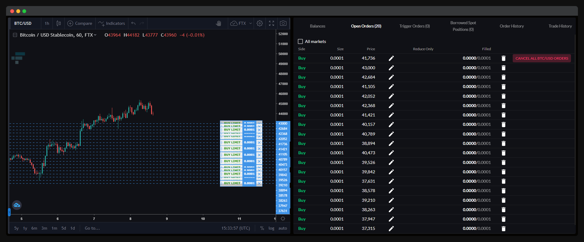

# Advanced orders

## Contents

- [Split order](#split-order)
  - [Examples](#examples)
- [Scaled order](#scaled-order)
  - [Examples](#examples-1)
- [TWAP order](#twap-order)
  - [Examples](#examples-2)
- [Scheduled order](#scheduled-order)
  - [Usage](#usage)
  - [Examples](#examples-3)
  - [Resources](#resources)
- [Notes](#notes)


## Split order


A split order is an order split into a number of smaller, equal-sized orders. Place a split order by including the [`split`](./README.md#split) option.

Split orders can be used to disguise the order size.

Compatible with all order types.

### Examples

```sh
# Overall order:
#
# Market buy 1 BTC/USD, split into 3 individual orders.
#
# Queued individual orders:
#
# 1. Market buy 0.3333 BTC/USD.
# 2. Market buy 0.3333 BTC/USD.
# 3. Market buy 0.3333 BTC/USD.
ftx trade --market btc/usd --side buy --type market --size 1 --split 3

# Overall order:
#
# Stop limit sell 9 BTC-PERP, split into 3 individual orders.
#
# Queued individual orders:
#
# 1. Stop limit sell 3 BTC-PERP at $11,000, triggering at $10,000.
# 2. Stop limit sell 3 BTC-PERP at $11,000, triggering at $10,000.
# 3. Stop limit sell 3 BTC-PERP at $11,000, triggering at $10,000.
ftx trade --market btc-perp --side sell --type stop-limit --size 9 --price 11k --trigger-price 10k --split 3
```


## Scaled order



A scaled order is a split limit order spread linearly across a price range instead of a single price. Place a scaled order by formatting the [`price`](./README.md#price) option as a price range.

Scaled orders can be used to minimise market impact or obtain a better average price when entering or exiting a position.

When scaled orders need to be queued due to rate limits, they will be queued from the first price to the second price in the price range. This effect will be more apparent the slower the account's rate limit and the higher the number of orders being sent in quick succession, and can be used to prioritise order placement sequence.

Compatible order types: `limit`, `stop-limit`, `take-profit-limit`.

### Examples

```sh
# Overall order:
#
# Limit buy 1 BTC/USD from $10,000 to $11,000.
#
# Queued individual orders:
#
# 1. Limit buy 0.3333 BTC/USD at $10,000.
# 2. Limit buy 0.3333 BTC/USD at $10,500.
# 3. Limit buy 0.3333 BTC/USD at $11,000.
ftx trade --market btc/usd --side buy --type limit --size 1 --price 10k:11k --split 3

# Overall order:
#
# Take profit limit sell 9 BTC-PERP from $140,000 to $100,000.
#
# Queued individual orders:
#
# 1. Take profit limit sell 3 BTC-PERP at $140,000.
# 2. Take profit limit sell 3 BTC-PERP at $120,000.
# 3. Take profit limit sell 3 BTC-PERP at $100,000.
ftx trade --market btc-perp --side sell --type take-profit-limit --size 9 --price 140k:100k --split 3
```


## TWAP order

A TWAP order is a split/scaled order spread linearly across a total order placement duration. Place a TWAP order by including the [`duration`](./README.md#duration) option.

TWAP orders can be used to minimise market impact or increase the seriality/predictability of order placement sequence.

### Examples

```sh
# Overall order:
#
# Market buy 1 BTC/USD, split into 3 individual orders, over a duration of 20 minutes.
#
# Timeline:
#
# 1. Now:               Market buy 0.3333 BTC/USD.
# 2. After 10 minutes:  Market buy 0.3333 BTC/USD.
# 3. After 20 minutes:  Market buy 0.3333 BTC/USD.
ftx trade --market btc/usd --side buy --type market --size 30 --split 3 --duration 20m

# Overall order:
#
# Limit sell 9 BTC-PERP from $60,000 to $61,000, split into 3 individual orders, over a duration of 1 minute 30 seconds.
#
# Timeline:
#
# 1. Now:                        Limit sell 3 BTC-PERP at $60,000.
# 2. After 45 seconds:           Limit sell 3 BTC-PERP at $60,500.
# 3. After 1 minute 30 seconds:  Limit sell 3 BTC-PERP at $61,000.
ftx trade --market btc-perp --side sell --type limit --size 3 --price 60k:61k --split 3 --duration 1m30s
```


## Scheduled order

A scheduled order is an order paired with a [scheduled command](./404.md).

Scheduled orders can be used to simulate complex time-based order types (e.g. Time-of-Day orders) or repeating investing strategies (e.g. Dollar-Cost Averaging).

> ℹ️ You can use scheduling with any command.

### Usage

#### ISO 8601

```
--schedule <ISO 8601 timestamp>  Schedule to run at a specific future date and time.
```

| Type                | Argument format             | Example                     |
| ------------------- | --------------------------- | --------------------------- |
| Local timezone      | `YYYY-MM-DDThh:mm:ss`       | `2021-01-01T00:00:00`       |
| UTC (exchange time) | `YYYY-MM-DDThh:mm:ssZ`      | `2021-01-01T00:00:00Z`      |
| UTC offset          | `YYYY-MM-DDThh:mm:ss±hh:mm` | `2021-01-01T00:00:00-01:00` |

- [ISO 8601 standard](https://www.iso.org/iso-8601-date-and-time-format.html)
- [ISO 8601 wiki](https://en.wikipedia.org/wiki/ISO_8601)
- [ISO 8601 playground](https://www.timestamp-converter.com/)

#### Cron expression/shorthand

```
--schedule <cron [expression|shorthand]>  Schedule to run at every given time period (local timezone) until manually aborted.
```

| Type         | Argument format |
| ------------ | --------------- |
| Standard     | `* * * * *`     |
| With seconds | `* * * * * *`   |

| Shorthand argument | Description                     |
| ------------------ | ------------------------------- |
| `every-second`     | Run at every new second.        |
| `every-minute`     | Run at every new minute.        |
| `hourly`           | Run at every new hour.          |
| `daily`            | Run at every new day.           |
| `weekly`           | Run at every new week (Monday). |
| `monthly`          | Run at every new month.         |
| `quarterly`        | Run at every new quarter.       |
| `yearly`           | Run at every new year.          |

- [Cron wiki](https://en.wikipedia.org/wiki/Cron)
- [Cron playground](https://crontab.guru/)

### Examples

```sh
# Market buy 1 BTC/USD on 1 January 2021 at 00:00:00 (local timezone).
ftx trade --market btc/usd --side buy --type market --size 1 --schedule 2021-01-01T00:00:00

# Market sell 2.5 BTC-PERP on 18 February 2021 at 18:30:00 (UTC).
ftx trade --market btc-perp --side sell --type market --size 2.5 --schedule 2021-02-18T18:30:00Z

# Market buy 10 ETH/BTC on 25 December 2021 at 07:46:39 (PST [UTC-08:00]).
ftx trade --market eth/btc --side buy --type market --size 10 --schedule 2021-12-25T07:46:39−08:00

# Market buy 100 FTT/USDT every day at 00:00:00 (local timezone).
ftx trade --market ftt/usdt --side buy --type market --size 100 --schedule daily

# Limit buy 10,000 USDT-0924 at $0.995 every Wednesday at 19:45:00 (local timezone) in August.
ftx trade --market usdt-0924 --side buy --type limit --size 10k --price 0.995 --schedule "45 19 * 8 3"
```


## Notes

It is possible for part of an advanced order to be rejected (e.g. connection loss, not enough margin). The current behaviour is to ignore rejected orders and continue, which may result in incomplete orders in some rare cases. We are looking into letting users customise this behaviour (e.g. prompt, ignore, cancel queued orders, cancel queued and placed orders).

The sequence in which orders are placed cannot be guaranteed for split or scaled orders, as FTX CLI favours speed instead (i.e. sending orders in parallel as early as possible). TWAP orders can be used to increase seriality/predictability.

FTX trading fees are charged per volume executed and not per trade executed, so multiple smaller orders will incur the same fees as if they were placed as a single large order.
