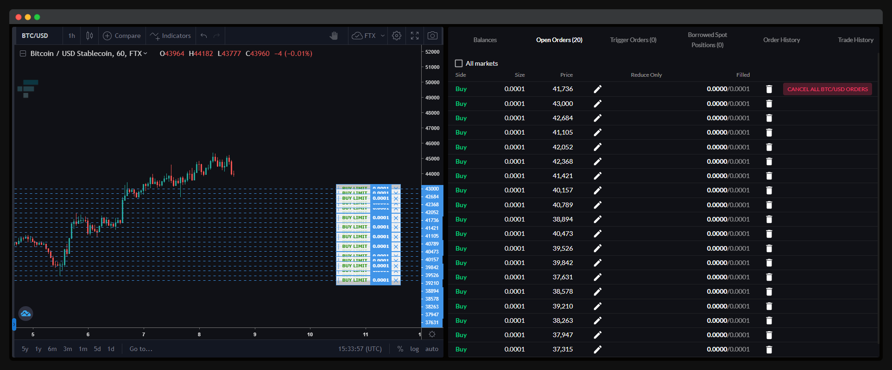

# Split, scaled, and TWAP orders

## Split order


A split order is an order which will be split into smaller, equal-sized orders. The split count will determine the resulting number of orders post-split.

Split orders can be used with any order type to disguise the order size.

```sh
# Place 3 orders:
#
# 1. Market buy 0.3333 BTC-PERP.
# 2. Market buy 0.3333 BTC-PERP.
# 3. Market buy 0.3333 BTC-PERP.
ftx trade --market btc-perp --side buy --type market --size 1 --split 3

# Place 3 orders:
#
# 1. Stop limit sell 0.3333 BTC-PERP at $11,000, triggering at $10,000.
# 2. Stop limit sell 0.3333 BTC-PERP at $11,000, triggering at $10,000.
# 3. Stop limit sell 0.3333 BTC-PERP at $11,000, triggering at $10,000.
ftx trade --market btc-perp --side sell --type stop-limit --size 1 --price 11k --trigger-price 10k --split 3
```


## Scaled order



A scaled order is a split limit order paired with a price range instead of a single price. The split orders will be spread linearly across the price range.

Price ranges have the following format: `--price X:Y`

Compatible order types:

- `limit`
- `stop-limit`
- `take-profit-limit`

Scaled orders can be used to minimise market impact and obtain a better average price when entering or exiting a position.

When scaled orders need to be queued due to rate limits, they will be queued from the first price to the second price in the price range. This effect will be more apparent the slower the account's rate limit and the higher the number of orders being sent in quick succession.

```sh
# Place 5 orders:
#
# 1. Limit buy 0.2 BTC-PERP at $10,000.
# 2. Limit buy 0.2 BTC-PERP at $10,250.
# 3. Limit buy 0.2 BTC-PERP at $10,500.
# 4. Limit buy 0.2 BTC-PERP at $10,750.
# 5. Limit buy 0.2 BTC-PERP at $11,000.
ftx trade --market btc-perp --side buy --type limit --size 1 --price 10k:11k --split 5

# Place 5 orders:
#
# 1. Take profit limit sell 1 BTC-PERP at $140,000.
# 2. Take profit limit sell 1 BTC-PERP at $130,000.
# 3. Take profit limit sell 1 BTC-PERP at $120,000.
# 4. Take profit limit sell 1 BTC-PERP at $110,000.
# 5. Take profit limit sell 1 BTC-PERP at $100,000.
ftx trade --market btc-perp --side sell --type take-profit-limit --size 5 --price 140k:100k --split 5
```


## TWAP order

A TWAP order is a split order paired with an placement duration. The split orders will be spread linearly across the placement duration (placement interval = placement duration / [split count - 1]).

Placement durations have the following format: `--duration XhYmZs`

TWAP orders can be used to minimise market impact.

```sh
# Overall order:
#
# Market buy 10 BTC-PERP, split into 5 individual orders, over a duration of 20 minutes.
#
# Order interval = 20 minutes / (5 - 1) = 5 minutes
#
# Timeline:
#
# 1. Now: market buy 2 BTC-PERP.
# 2. After 5 minutes: market buy 2 BTC-PERP.
# 3. After 10 minutes: market buy 2 BTC-PERP.
# 4. After 15 minutes: market buy 2 BTC-PERP.
# 5. After 20 minutes: market buy 2 BTC-PERP.
ftx trade --market btc-perp --side buy --type market --size 10 --split 5 --duration 20m

# Overall order:
#
# Scaled limit buy 40 FTT/USD from $19 to $19.9, split into 10 individual orders, over a duration of 1 minute 30 seconds.
#
# Order interval = 1 minute 30 seconds / (10 - 1) = 10 seconds
#
# Timeline:
#
# 1. Now: limit buy 4 FTT/USD at $19.
# 2. After 10 seconds: limit buy 4 FTT/USD at $19.1.
# 3. After 20 seconds: limit buy 4 FTT/USD at $19.2.
# 4. After 30 seconds: limit buy 4 FTT/USD at $19.3.
# 5. After 40 seconds: limit buy 4 FTT/USD at $19.4.
# 6. After 50 seconds: limit buy 4 FTT/USD at $19.5.
# 7. After 60 seconds: limit buy 4 FTT/USD at $19.6.
# 8. After 70 seconds: limit buy 4 FTT/USD at $19.7.
# 9. After 80 seconds: limit buy 4 FTT/USD at $19.8.
# 10. After 90 seconds: limit buy 4 FTT/USD at $19.9.
ftx trade --market ftt/usd --side buy --type limit --size 40 --split 10 --duration 1m30s
```


## Notes

It is possible for part of a split, scaled, or TWAP order to be rejected (e.g. connection loss, not enough margin). The current behaviour is to ignore rejected orders and continue, which may result in incomplete orders in some rare cases. We are looking into letting users customise this behaviour (e.g. prompt, ignore, cancel queued orders, cancel queued and placed orders).

FTX trading fees are charged per volume executed and not per trade executed, so multiple smaller orders will incur the same fees as if they were placed as a single large order.
